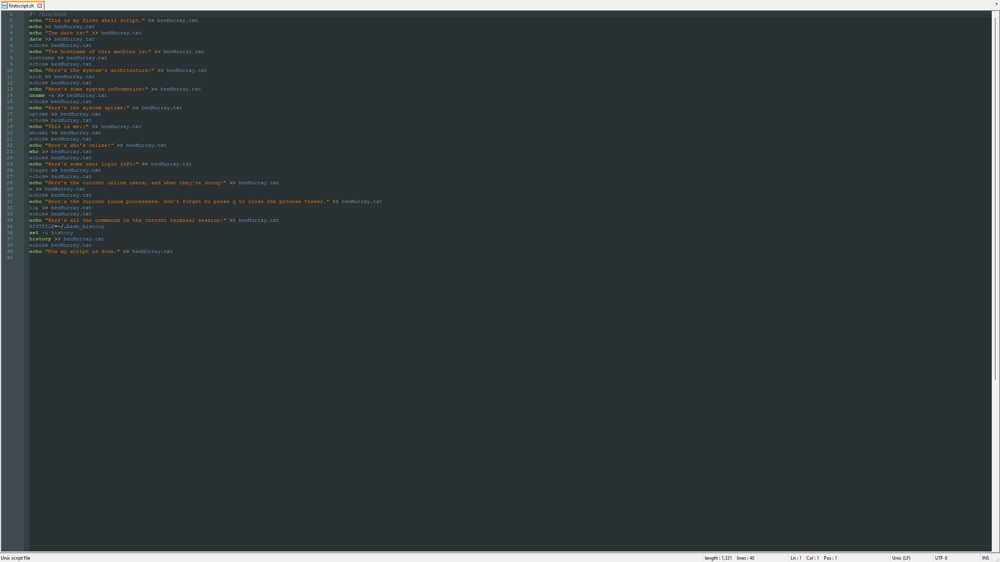
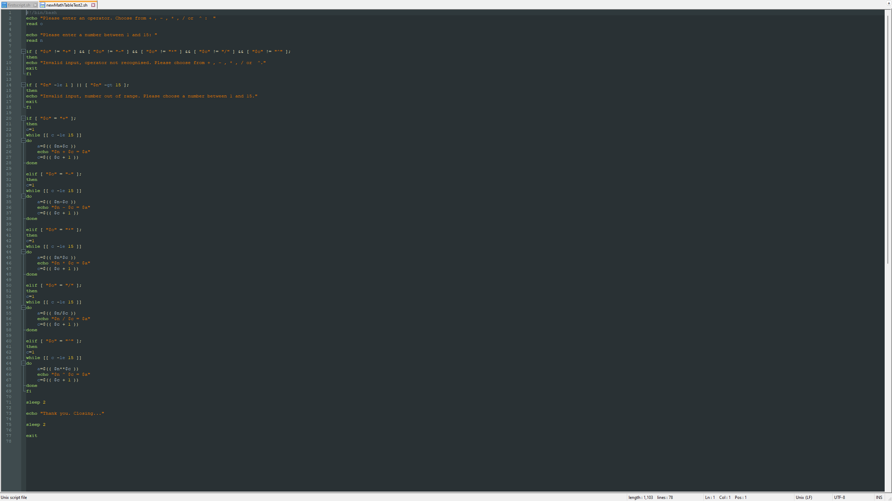
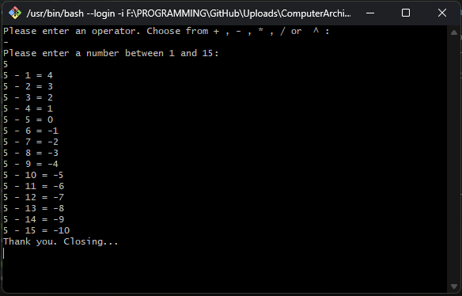

# Computer_Architecture

Bash scripts written for Computer Architecture module. Scripts were written on a remote AWS instance as part of an exercise to familiarise
students with Linux, remote server access and the terminal. 

Bash script generates .txt file from various command outputs:

Bash script for simple maths table generator:

Math table generator output:

